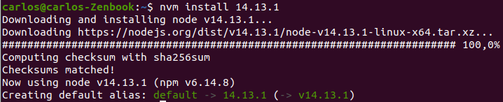
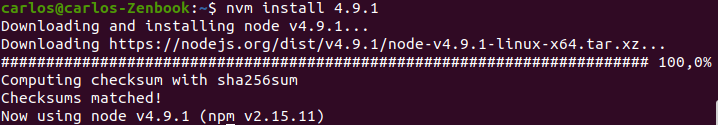
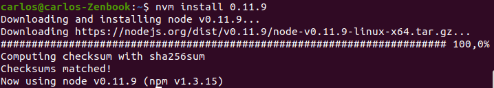
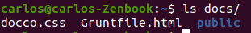
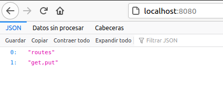
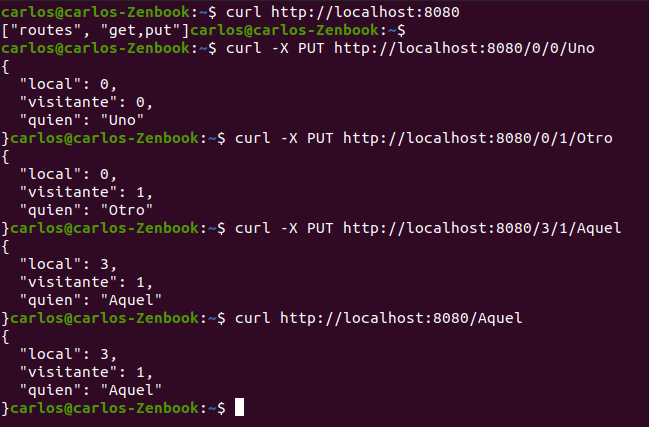
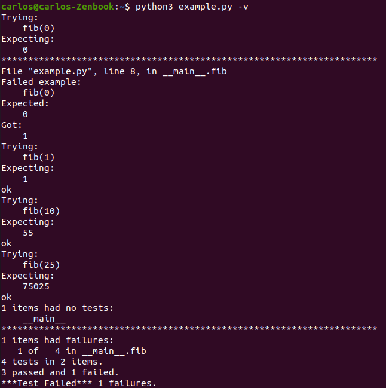
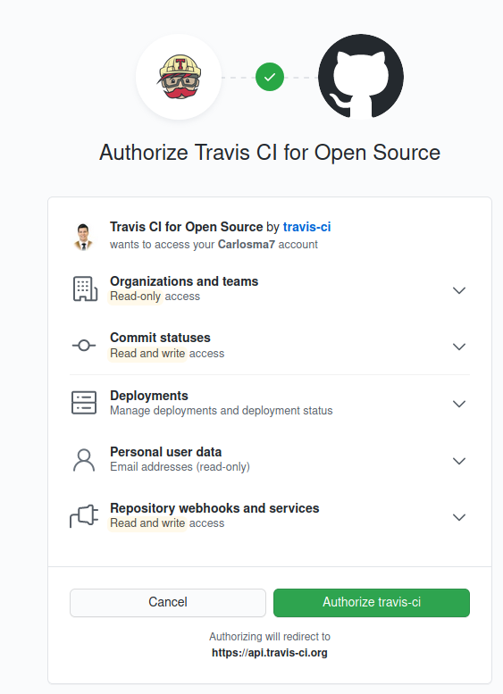

# Ejercicios de autoevaluación tema 2 - Cloud Computing.
# Desarrollo Basado en Pruebas

---

### 1- Instalar alguno de los entornos virtuales de node.js (o de cualquier otro lenguaje con el que se esté familiarizado) y, con ellos, instalar la última versión existente, la versión minor más actual de la 4.x y lo mismo para la 0.11 o alguna impar (de desarrollo).

Para la realización de este ejercicio he decidido instalar **node.js** mediante **nvm**, para ello he seguido este [tutorial de instalación de nvm](https://www.sitepoint.com/quick-tip-multiple-versions-node-nvm/).

Para ello inicialmente he descargado *nvm* con la orden:

`curl -o- https://raw.githubusercontent.com/creationix/nvm/v0.35.2/install.sh | bash`

A continuación, he buscado las distintas releases de *nvm* con la instrucción `nvm ls-remote`. Aquí he podido observar las distintas versiones, y he utilizado `nvm install [version]` para instalar dichas versiones.

* Versión 14.13.1 (latest)



* Versión 4.9.1 (minor)



* Versión 0.11.9 (impar)




### 2- Crear una descripción del módulo usando package.json. En caso de que se trate de otro lenguaje, usar el método correspondiente.

Para la creación de una descripción con **package.json** he utilizado **npm**, siguiendo el [tutorial de creación de package.sjon](https://docs.npmjs.com/creating-a-package-json-file).

Primero, ejecutaremos *npm* y crearemos el paquete rellenando la información que se nos solicite en cada momento:

`npm init`

Podemos ver el resultado de nuestro *package.json*:

```
{
  "name": "test_carlos",
  "version": "1.0.0",
  "description": "Apuesta en una porra",
  "main": "index.js",
  "scripts": {
    "test": "make test"
  },
  "repository": {
    "type": "git",
    "url": "git+https://github.com/Carlosma7/EJERCICIOS-CC.git"
  },
  "author": "Carlos Morales Aguilera",
  "license": "ISC",
  "bugs": {
    "url": "https://github.com/Carlosma7/EJERCICIOS-CC/issues"
  },
  "homepage": "https://github.com/Carlosma7/EJERCICIOS-CC#readme"
}
```

A continuación utilizaremos *npm* e instalamos *sqlite*, *grunt* y *docco*:

1. npm install sqlite --save-dev
2. npm install -g grunt-cli 
3. npm install grunt --save-dev
4. npm install docco grunt-docco --save-dev

Para tener un archivo de **Gruntfile.js** he seguido este [ejemplo](https://gruntjs.com/getting-started). Una vez he creado el fichero, he ejecutado con `grunt docco`. A continuación se genera una carpeta con la documentación, el fichero *Gruntfile.html* y *docco.css*:




### 3- Descargar el repositorio de ejemplo anterior, instalar las herramientas necesarias (principalmente Scala y sbt) y ejecutar el ejemplo desde sbt. Alternativamente, buscar otros marcos para REST en Scala tales como Finatra o Scalatra y probar los ejemplos que se incluyan en el repositorio.

Para realizar el ejercicio, he tenido que instalar **Java 8**, **Scala** y **Scala Build Test (SBT)**. Para ello he seguido este [tutorial de instalación](www.codebind.com/linux-tutorials/install-scala-sbt-java-ubuntu-18-04-lts-linux/) (para la instalación de *Java* está obsoleto, en mi caso he tenido que instalar siguiendo las instrucciones de *Java 8 openjdk*).

Una vez instalado, he clonado el repositorio del profesor con:

`git clone https://github.com/JJ/spray-test`

A continuación, dentro de la carpeta del repositorio, ejecutamos *sbt* con la orden `sbt` (tarda un rato en ejecutarse debido a las dependencias). Y a continuación, dentro de la shell ejecutamos `test` e iniciamos las pruebas con `re-start`.

Si observamos en nuestro *localhost* en el puerto *8080* podemos observar:



Ejecutamos ahora las pruebas con `curl`:



Finalizamos la ejecución en la terminal con `re-stop`.

### 4- Para la aplicación que se está haciendo, escribir una serie de aserciones y probar que efectivamente no fallan. Añadir tests para una nueva funcionalidad, probar que falla y escribir el código para que no lo haga. A continuación, ejecutarlos desde mocha (u otro módulo de test de alto nivel), usando descripciones del test y del grupo de test de forma correcta. Si hasta ahora no has subido el código que has venido realizando a GitHub, es el momento de hacerlo, porque lo vamos a necesitar un poco más adelante.

En mi caso he decidido utilizar [doctest](https://docs.python.org/3/library/doctest.html) ya que estoy familiarizado por su uso en alguna asignatura previa, para ello he decidido escoger un ejemplo simple como puede ser una función que implementa [la serie de Fibonacci](https://es.wikipedia.org/wiki/Sucesi%C3%B3n_de_Fibonacci). Para ello he realizado un código que cálcula la serie, introduciendo un error que provoca que el valor 0 de la serie no produzca el valor esperado.

Se muestra entonces el código del *TDD*:


```

import doctest


def fib(n):
    """ 
    Calculates the n-th of the Fibonacci's series

    >>> fib(0)
    0
    >>> fib(1)
    1
    >>> fib(10) 
    55
    >>> fib(25)
    75025
    >>> 

    """
    
    n = n+1
    
    a = 0
    b = 1
    if n <= 0:
        return 0
    elif n == 1:
        return b
    else:
        for i in range(2,n):
            c = a + b
            a = b
            b = c
        return b

if __name__ == "__main__": 
    doctest.testmod()
    
```

A continuación se muestra el resultado del test, en el que podemos observar que la solución propuesta de no sería válida ya que en el caso del número 0 de la serie daría un resultado diferente del esperado:



### 5- Ejercicio: Haced los dos primeros pasos antes de pasar al tercero.

1. Darse de alta. En mi caso he decidido utilizar la plataforma **Travis**.



2. Activar el repositorio en el que se vaya a aplicar la integración continua.


3. Crear fichero de configuración, en mi caso al trabajar en Python, he optado inicialmente por un fichero de configuración sencillo, tal y como se muestra en la [página oficial de Travis](https://docs.travis-ci.com/user/languages/python/):

```
  language: python
  script:
    - pytest
```
