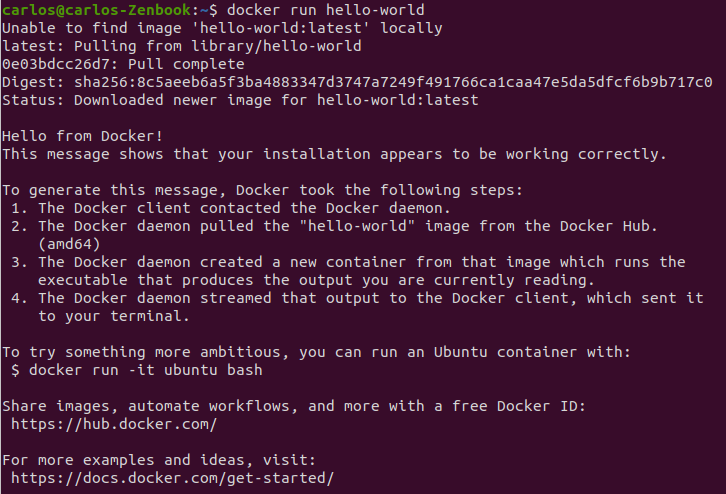
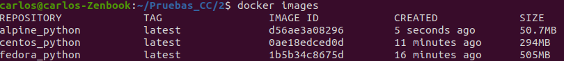
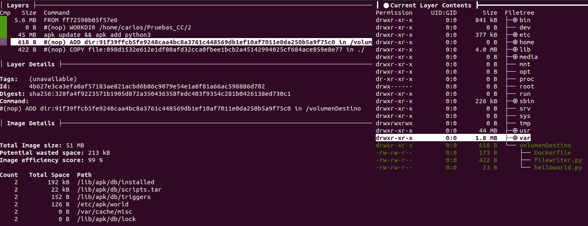

# Ejercicios de autoevaluación tema 3 - Cloud Computing.

### 1- Buscar alguna demo interesante de Docker y ejecutarla localmente, o en su defecto, ejecutar la imagen anterior y ver cómo funciona y los procesos que se llevan a cabo la primera vez que se ejecuta y las siguientes ocasiones.

Para instalar **Docker** se ha seguido el [manual oficial](https://docs.docker.com/engine/install/ubuntu/) de instalación en Linux.


Mostramos un ejemplo ejecutando la imagen de *Hello-world*:



A continuación configuramos **docker-machine** , instalándolo siguiendo el [manual oficial](https://docs.docker.com/engine/install/ubuntu/) de instalación. Posteriormente creamos una máquina y configuramos el entorno con:

```bash
docker-machine create --driver virtualbox default
docker-machine ls
docker-machine env default
```

He decidido utilizar una imagen de docker correspondiente al profesor que podemos encontrar en su **Docker Hub**, que consiste en un intérprete de **Raku**. La imagen es [jjmerelo/alpine-raku](https://hub.docker.com/r/jjmerelo/alpine-raku).


Y a continuación se realiza una ejecución de la misma:


### 2- Tomar algún programa simple, "Hola mundo" impreso desde el intérprete de línea de órdenes, y comparar el tamaño de las imágenes de diferentes sistemas operativos base, Fedora, CentOS y Alpine, por ejemplo.

Para utilizar los distintos sistemas operativos base creamos el **Dockerfile** correspondiente a cada sistema.

1. Fedora

```shell

FROM fedora:latest

WORKDIR /home/carlos/Pruebas_CC/2

RUN yum install python38 -y

COPY ./helloworld.py ./

CMD ["python3", "./helloworld.py"]
```

A continuación creamos el docker con la orden `docker build --no-cache -t fedora_python -f Dockerfile .`. Una vez creado con todas sus dependencias, lanzamos el contenedor con la orden `docker run --rm fedora_python`:


2. CentOS

```shell

FROM centos:centos8

WORKDIR /home/carlos/Pruebas_CC/2

RUN yum install python38 -y

COPY ./helloworld.py ./

CMD ["python3", "./helloworld.py"]
```

A continuación creamos el docker con la orden `docker build --no-cache -t centos_python -f Dockerfile .`. Una vez creado con todas sus dependencias, lanzamos el contenedor con la orden `docker run --rm centos_python`:


3. Alpine

```shell

FROM alpine:latest

WORKDIR /home/carlos/Pruebas_CC/2

RUN yum install python38 -y

COPY ./helloworld.py ./

CMD ["python3", "./helloworld.py"]
```

A continuación creamos el docker con la orden `docker build --no-cache -t alpine_python -f Dockerfile .`. Una vez creado con todas sus dependencias, lanzamos el contenedor con la orden `docker run --rm alpine_python`:


A continuación observamos una comparativa de las imágenes creadas con Docker, utilizando la orden `docker images`:



Se pude observar claramente que la imagen con menor peso es la de *Alpine*, seguida de *centOS* y por último *Fedora*. La imagen de *Alpine* posee únicamente lo necesario para ejecutar nuestro programa, mientras que *Fedora* por ejemplo realiza una instalación completa.

### 3-Crear a partir del contenedor anterior una imagen persistente con _commit_.

Para crear la imagen persistente, necesitaremos ejecutar la orden `docker commit <CONTAINER ID> <NEW IMAGE NAME>`.

Para ello ejecutaremos la última imagen creada en el anterior ejercicio con *Alpine* (ya que es la más ligera) y veremos el último contenedor haciendo uso de la orden `docker ps -l`. Posteriormente, tras obtener el ID del contenedor, creamos la imagen con la orden `docker commit` y observamos que se ha creado correctamente:


### 4-Examinar la estructura de capas que se forma al crear imágenes nuevas a partir de contenedores que se hayan estado ejecutando.

Un contenedor se genera gracias a la ejecución de una imagen. A su vez una imagen de docker funciona mediante una arquitectura de capas que se ejecutan, especificadas en el archivo Dockerfile, el cual indica las capas a lanzarse. Las capas al final indican que acciones se han de realizar en la configuración de la imagen.

Para poder ver las distintas capas que conforman una imagen, utilizaremos la orden `docker history <IMAGE>`. A continuación se pueden ver las capas tanto de las imágenes persistentes de *Alpine* y *Fedora*:


### 5-Crear un volumen y usarlo, por ejemplo, para escribir la salida de un programa determinado.

Para enteder que es un volumen en Docker, se puede seguir la [explicación](https://docs.docker.com/storage/volumes/) en la página oficial de Docker. Un breve resumen es que sirven para conservar los ficheros que se generan en un contenedor en un espacio que es gestionado por Docker.

Generamos un volumen con la orden `docker volume create <Volume>` y podemos observarlos con `docker volume list`. Por último, podemos ver la información asociada a un volumen con la orden `docker inspect <Volume>`.


A continuación para probar el ejemplo de que se monta correctamente, se crea una nueva imagen y se monta sobre el volumen creado. Para ello se crea el siguiente fichero en python que escribe y lee un fichero sencillo:

```python
# Escritura y almacenamiento del fichero
print("Hola, voy a escribir mi nombre en un fichero.")

f = open("/volumenDestino/nombre.txt", "x")
f.write("Mi nombre es Carlos Morales Aguilera.")
f.close()

print("Ya he escrito mi nombre en el fichero.")

# Lectura del fichero
print("¡Hola de nuevo! Ahora voy a leer el nombre del fichero nombre.txt.")

n = open("/volumenDestino/nombre.txt", "r")

print(n.read())

n.close()
```

Y creamos el siguiente Dockerfile indicando donde montamos el volumen:

```shell
FROM alpine:latest

WORKDIR /home/carlos/Pruebas_CC/2

RUN apk update && apk add python3

ADD . /volumenDestino

COPY ./filewriter.py ./

CMD ["python3", "./filewriter.py"]
```

Se crea y ejecuta sobre el volumen la imagen de Docker para utilizar el programa diseñado:

```bash
docker build --no-coche -t alpine_fichero -f Dockerfile .

docker run --mount source=volumenCarlos,destination=/volumenDestino alpine_fichero
```


A continuación para poder visualizar como se ha montado el volumen en nuestro contenedor, he decidido utilizar una herramienta que muestra la información de las capas y sus contenidos diseñada en *Go* llamada **Dive**. Con ella podemos confirmar que el punto de montaje está correctamente configurado y que posee los permisos adecuados:



### 6- Usar un miniframework REST para crear un servicio web y introducirlo en un contenedor, y componerlo con un cliente REST que sea el que finalmente se ejecuta y sirve como “frontend”.

Este ejercicio se plantea como una pequeña demostración de microservicios, y su contenerización en contenedores Docker. Para ello vamos a crear dos microservicios, uno como servidor con una API RESTful y otro como un cliente REST que obtiene del servidor el nombre de una asignatura y que se ejecuta como frontend.


Para ello se ha diseñado el siguiente servicio como *servidor* con API RESTful utilizando Python con Flask:

```Python
from flask import Flask, jsonify, request


# initialize our Flask application
app= Flask(__name__)


@app.route("/api_rest_carlos", methods=["GET"])
def message():
    data = "Cloud Computing"
    return jsonify(data)

if __name__=='__main__':
    app.run(host='0.0.0.0')
```

Por otro lado se ha diseñado el siguiente servicio como *cliente* utilizando Python con Request:

```Python
import requests 

r = requests.get("http://172.17.0.1:5000/api_rest_carlos", verify=False).json()

print("La asignatura recibida es %s" % r)
```

A continuación, se han de diseñar los Dockerfiles correspondientes a las imágenes de Docker asociadas a cada servicio, con sus correspondientes ficheros de *requirements* de Python.

**Servidor**

* requirements.txt

```
flask
flask-restful
```

* Dockerfile

```shell
# docker build -t servidor .
# docker run -p 5000:5000 servidor

FROM python:3.8

WORKDIR .

COPY requirements.txt server.py ./

RUN pip install -r requirements.txt

COPY . .

# Abrir puerto 5000
EXPOSE 5000

CMD ["python", "./server.py"]
```

Si lanzamos el servidor y accedemos a nuestro localhost, en el puerto 5000 que es el que trae por defecto configurado Flask, dentro de nuestro directorio */api_rest_carlos*, podemos observar que efectivamente funciona nuestro servidor:


**Cliente**

* requirements.txt

```
requests
```

* Dockerfile

```shell
# docker build -t cliente .
# docker run -p 5001:5001 cliente

FROM python:3.8

WORKDIR .

COPY requirements.txt client.py ./

RUN pip install -r requirements.txt

COPY . .

# Abrir puerto 5001
EXPOSE 5001

CMD ["python", "./client.py"]
```

A continuación, podríamos simplemente construir cada contenedor por separado, ejecutar primero el servidor y a continuación el cliente para que obtuviera la información del servidor. La idea de este ejercicio es ver como dichos microservicios se pueden orquestar mediante la funcionalidad **docker-compose**, el cual tiene su fichero de orquestación *docker-compose.yml*:

```YAML
version: '2'
services:
   servidor:
      container_name: servidor
      restart: always
      build: servidor/.
      ports:
      - "5000:5000"

   cliente:
      container_name: cliente
      build: cliente/.
      stdin_open: true
      depends_on: 
        - servidor
      ports:
      - "5001:5001"
```

A continuación se lanzaría la orquestación con la orden `docker-compose up --build`:


Como podemos observar, empieza a generarse la imagen del servidor, y posteriormente se genera la imagen del cliente. Una vez finalizado se ejecuta la imagen del servidor, y a continuación tal y como hemos indicado en el apartado de dependencia del cliente en el *docker-compose.yml*, se ejecuta el cliente:


### 7- Reproducir los contenedores creados anteriormente usando un Dockerfile.

### 8- Crear con docker-machine una máquina virtual local que permita desplegar contenedores y ejecutar en él contenedores creados con antelación.


