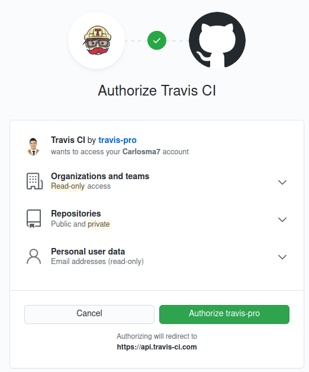
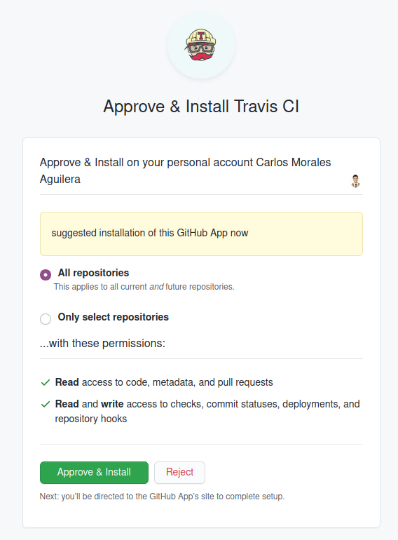
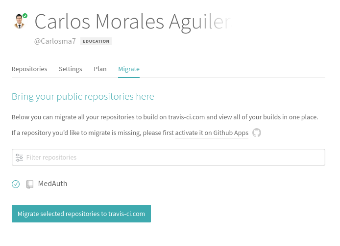
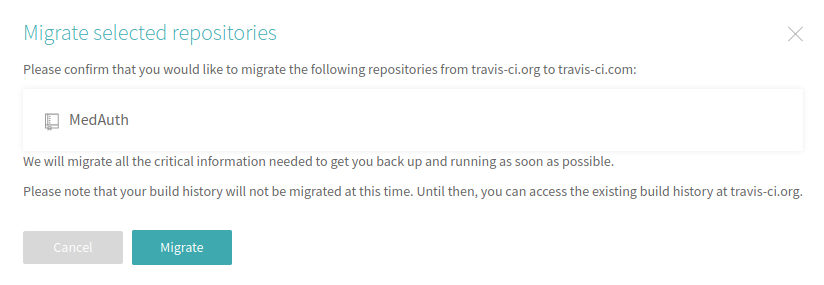
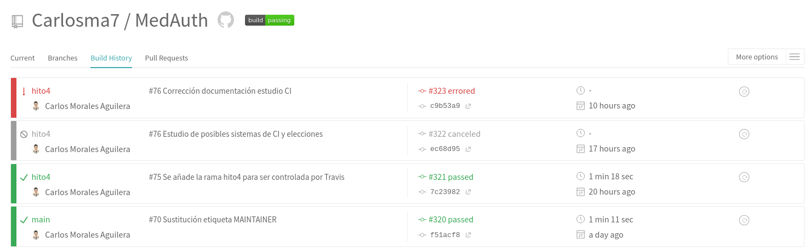

### 1. Ejercicio: Haced los dos primeros pasos antes de pasar al tercero.

1. Darse de alta. En mi caso he decidido utilizar la plataforma **Travis**.


2. Activar el repositorio en el que se vaya a aplicar la integración continua.


3. Crear fichero de configuración, en mi caso al trabajar en Python, he optado inicialmente por un fichero de configuración sencillo, tal y como se muestra en la [página oficial de Travis](https://docs.travis-ci.com/user/languages/python/):

```
  language: python
  script:
    - pytest
```

### 2. Ejercicio: Configurar integración continua para nuestra aplicación usando Travis o algún otro sitio.

Para poder configurar Travis, se deben seguir los siguientes pasos:

1. Darse de alta. (En mi caso lo hice al inicio del proyecto como se pedía en los ejercicios, pero por desconocimiento lo realicé en **Travis-ci.org**, por lo que posteriormente habrá que migrar a **Travis-ci.com**).

	

2. Activar el repositorio en el que se vaya a aplicar la integración continua. (El repositorio actualmente se llama *MedAuth*, pero cuando se realizó el procedimiento se llamaba *CC-MedAuth*, aunque esto no afecta a la configuración).

	

3. Tal y como se puede leer en este [newsletter de Travis](https://mailchi.mp/3d439eeb1098/travis-ciorg-is-moving-to-travis-cicom), *Travis-ci.org* va a ser apagado el 31 de diciembre de este año, y se trabajará únicamente con *Travis-ci.com*, por lo que para ello hay que dirigirse a dicha plataforma, y al igual que en el primer paso, registrarse con *GitHub*:

	

4. Una vez ya está dado de alta, se procede a conectar Travis a nuestro perfile de *GitHub*, para ello en la pantalla inicial de *Travis* (a partir de este punto nos referiremos siempre a *Travis-ci.com* como *Travis*) seleccionaremos la opción ```Activate all repositories using GitHub App```:

	

5. Dar permiso e installar:

	

6. A continuación se visualizan los repositorios en *Travis*, menos el repositorio del proyecto, ya que esté no ha sido migrado, para ello nos dirigiremos a nuestro Perfil -> *Settings*, y una vez allí nos dirigiremos a la pestaña ```Migrate```. Una vez allí seleccionaremos el repositorio y seleccionaremos en ```Migrate selected repositories to travis-ci.com```:

	

7. Confirmamos seleccionando ```Migrate```.

	
	
8. Podemos observar que se ha configurado correctamente ya que se pueden observar todos los *builds* previos:

	
	
### Configuración .travis.yml

Se puede ver el fichero **.travis.yml** [aquí](https://github.com/Carlosma7/MedAuth/blob/main/.travis.yml).

Cada vez que se realiza un *push*, *Travis* mediante *triggers* automatiza el proceso de ejecución de *builds*, usando para ello el fichero de configuración definido en nuestro repositorio, denominado ```.travis.yml```. Este fichero contiene los *pipelines* que permiten la ejecución del *build* y las diferentes características de dicho build, mediante *YAML*.

En el proyecto, hay que tener en cuenta los siguientes requisitos de cara a la configuración del fichero *.travis.yml*:

* El lenguaje debe ser Python3.8, pero se debe comprobar también con versiones inferiores como la 3.6 o 3.7.
* Se deben tener en cuenta las dependencias del proyecto que hacen que este funcione como biblioteca de aserciones, gestor de tareas o marco de pruebas.
* Una buena práctica es únicamente llevar un seguimiento de aquello que se desea testear, por lo que se indican las ramas. Actualmente estamos trabajando con dos ramas por lo que se indican estas, pero al realizar el *merge* correspondiente, deberá modificarse el fichero para que únicamente trabaje con la rama *main*.
* Ejecución de tests, empleando para ello el gestor de tareas previamente configurado.

```yaml
---
# Language Python with versions 3.6, 3.7 and 3.8
language: python
python:
  - "3.6"
  - "3.7"
  - "3.8"

# Install dependencies (Invoke, Pytest and Assertpy)
install:
  - pip3 install -r requirements.txt

# Branches to track (we are working currently with two branches)
branches:
  only:
    - main

# Launch tests using the task manager
script:
  - invoke tests
```
