### 1. Ejercicio: Instalar etcd3, averiguar qué bibliotecas funcionan bien con el lenguaje que estemos escribiendo el proyecto (u otro lenguaje), y hacer un pequeño ejemplo de almacenamiento y recuperación de una clave; hacer el almacenamiento desde la línea de órdenes (con etcdctl) y la recuperación desde el mini-programa que hagáis.

Para instalar y realizar una configuración básica de **Etcd3** se ha utilizado el siguiente [tutorial](https://computingforgeeks.com/how-to-install-etcd-on-ubuntu-18-04-ubuntu-16-04/), aunque he utilizado la última *release* de **etcd** en lugar de la indicada en el tutorial.

Tras realizar la instalación, se puede observar que *etcd* está correctamente configurado:

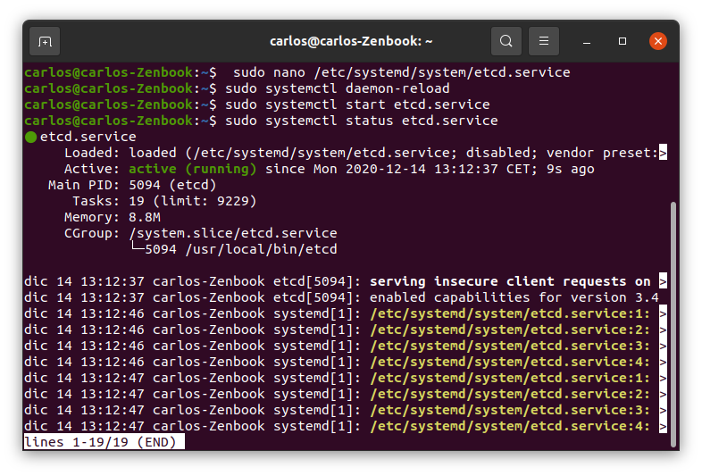

Y podemos observar la versión disponible:

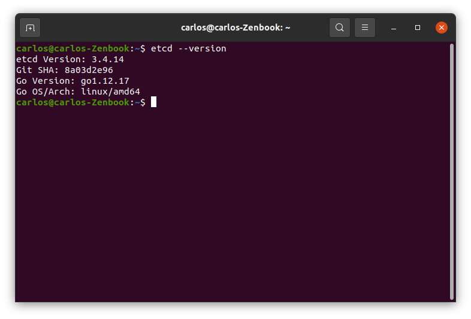

Se ha creado la variable *prueba* con valor *cloudcomputing* utilizando la orden ```etcdctl put prueba cloudcomputing```, con un *GET* podemos observar que se ha configurado correctamente:

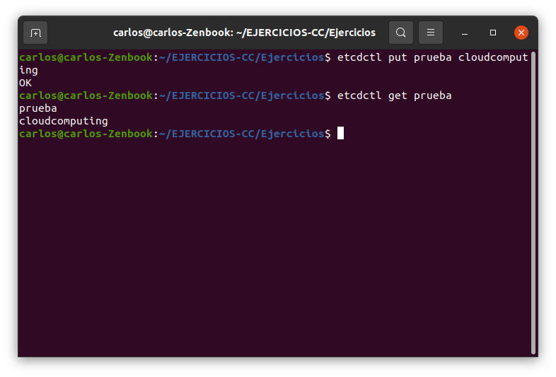

Para poder trabajar con *Python*, que es el lenguaje utilizado en el proyecto, se han encontrado dos librerías principales: **etcd3** y **python-etcd**, en este caso vamos a trabajar con *etcd3*, ya que es la más estandarizada en los ejemplos encontrados. Para ello se instala con ```pip3 install etcd3```.

Por último, se ha diseñado [este programa](https://github.com/Carlosma7/EJERCICIOS-CC/tree/main/Ejercicios/scripts/microservicios/prueba_etcd.py) el cual permite obtener la variable desde *Python*.

```python
import etcd3
import sys

def main( argv = [] ):
	etcd = etcd3.client()
	if(argv):
		print(etcd.get(argv[0]))


if __name__ == "__main__":
    if len(sys.argv) == 2:
        main(sys.argv[1:])
    else:
        print("Wrong number of arguments")
```

Se puede observar ejecutándolo con ```python3 prueba_etcd.py prueba```:

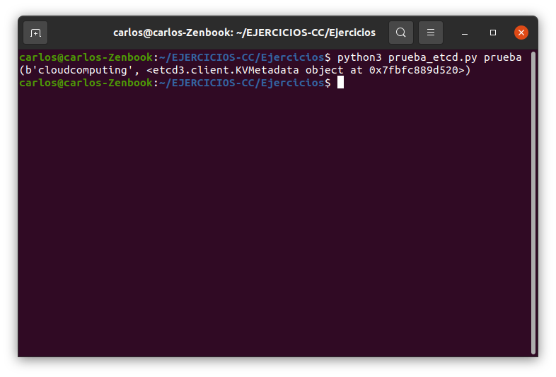

### 2. Ejercicio: Realizar una aplicación básica que use algún microframework para devolver alguna estructura de datos del modelo que se viene usando en el curso u otra que se desee. La intención de este ejercicio es simplemente que se vea el funcionamiento básico de un microframework, especialmente si es alguno que, como express, tiene un generador de código. Se puede usar, por otro lado, el lenguaje y microframework que se desee.

Para la realización del ejercicio he escogido utilizar **Python3** con [Flask](https://flask.palletsprojects.com/en/1.1.x/). Para ello se ha diseñado [este programa](https://github.com/Carlosma7/EJERCICIOS-CC/tree/main/Ejercicios/scripts/microservicios/app1.py)

```python
from flask import Flask, jsonify
import json
app1 = Flask(__name__)


@app1.route('/api/fruits')
def get_frutas():
	apple = json.dumps({"name": "Apple", "color": "Red", "family": "Acid"})
	avocado = json.dumps({"name": "Avocado", "color": "Green", "family": "Neutral"})
	pear = json.dumps({"name": "Pear", "color": "Green", "family": "Sweet"})

	return jsonify([apple, avocado, pear]), 200

if __name__ == '__main__':
    app1.run()
```

A continuación vemos que se ejecuta correctamente:

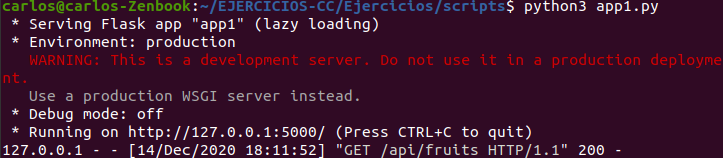

Y si observamos en el navegador en la dirección ```http://127.0.0.1:5000/api/fruits``` (por defecto *Flask* usa de host ```127.0.0.1``` y el puerto ```5000```) se puede observar el resultado:

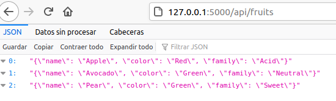

### 3. Ejercicio: Programar un microservicio en express (o el lenguaje y marco elegido) que incluya variables como en el caso anterior.

Tal y como se puede ver, en el ejercicio anterior se han utilizado variables, pero para añadir algo nuevo se ha añadido al ejemplo anterior un nuevo método *POST*. Se puede ver el programa [aquí](https://github.com/Carlosma7/EJERCICIOS-CC/tree/main/Ejercicios/scripts/microservicios/app2.py).

```python
from flask import Flask, jsonify, request
import json
app2 = Flask(__name__)

def set_routes(app2):
	@app2.route('/api/fruits')
	def get_frutas():
		apple = json.dumps({"name": "Apple", "color": "Red", "family": "Acid"})
		avocado = json.dumps({"name": "Avocado", "color": "Green", "family": "Neutral"})
		pear = json.dumps({"name": "Pear", "color": "Green", "family": "Sweet"})

		return jsonify([apple, avocado, pear]), 200
	
	@app2.route('/api/insert', methods=['POST'])
	def insert_fruit():
		data_string = request.get_data()
		data = json.loads(data_string)
		
		fruit_name = data.get('name')
		fruit_color = data.get('color')
		fruit_family = data.get('family')

		if fruit_name and fruit_color and fruit_family:
			return 'Ok', 200
		else:
			return 'Error', 400

if __name__ == '__main__':
    app2.run()
```
### 4. Ejercicio: Crear pruebas para las diferentes rutas de la aplicación.

Para crear las pruebas, se ha visto la documentación oficial de [Tests con Flask](https://flask.palletsprojects.com/en/1.1.x/testing/) en el que se recomienda utilizar *Pytest*. Para ello se han diseñado dos tests, que realizan pruebas simples sobre los métodos creados en el programa del ejercicio anterior. Se pueden ver los tests [aquí](https://github.com/Carlosma7/EJERCICIOS-CC/tree/main/Ejercicios/scripts/microservicios/test_app2.py)

```python
from flask import Flask
import json
import pytest

from app2 import set_routes

# Test que comprueba que existe una fruta roja
def test_one_red_fruit():
    app = Flask(__name__)
    set_routes(app)
    client = app.test_client()
    url = '/api/fruits'

    response = client.get(url)
    
    # Assert status code Ok
    assert response.status_code == 200
    
    fruits = response.get_data()
    fruits = json.loads(fruits)
    # Assert there is a red fruit
    assert 'Red' in [json.loads(fruit)['color'] for fruit in fruits]

# Test que se inserta una nueva fruta con el formato correcto
def test_new_fruit():
	app = Flask(__name__)
	set_routes(app)
	client = app.test_client()
	url = '/api/insert'
	
	new_fruit = {
		'name': 'Banana',
		'color': 'Yellow',
		'family': 'Sweet'
	}
	
	response = client.post(url, data = json.dumps(new_fruit))
	assert response.status_code == 200
```

Se puede ver que pasan los tests:

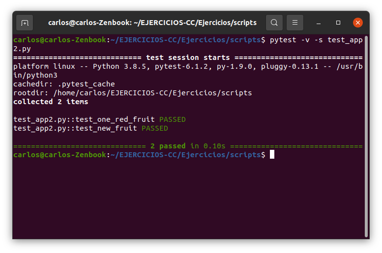

### 5. Ejercicio: Experimentar con diferentes gestores de procesos y servidores web front-end para un microservicio que se haya hecho con antelación, por ejemplo en la sección anterior.

Dentro de los posibles gestores de procesos, para *Python* se han encontrado las siguientes opciones:

* **PM2**.
* **pman**.
* **Supervisord**.

Para instalar pm2 ejecutamos ```sudo npm install pm2 -g```. Una vez instalado, se procede a iniciar las aplicaciones con la orden ```pm2 start app2.py --name fruits --interpreter python3 -i 3```, utilizando *Python* como intérprete y un total de 3 instancias. Se puede ver que funciona correctamente:

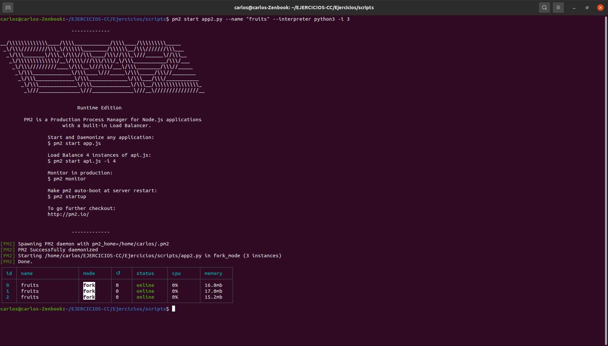

A continuación, podemos parar el servicio con ```pm2 stop fruits```:

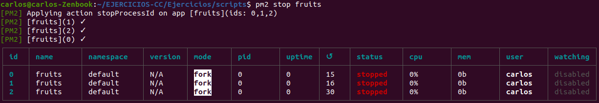

Si queremos volver a lanzar las instancias, se realiza con ```pm2 reload fruits```:

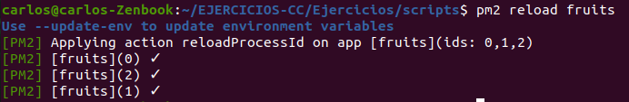

Además, una de las funciones interesantes de *PM2* es el poder visualizar la información de las diferentes instancias con la orden ```pm2 describe fruits```:

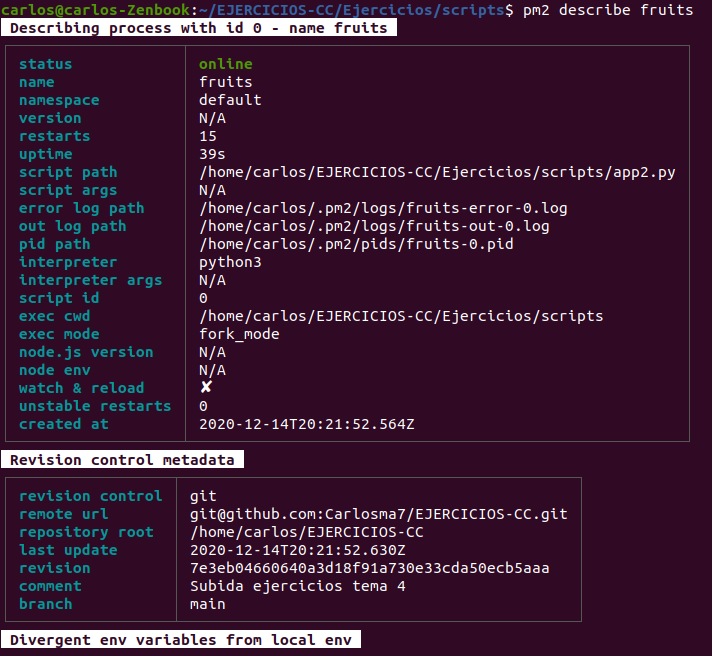

Por último, si queremos eliminar los procesos, basta con indicar ```pm2 delete fruits```:

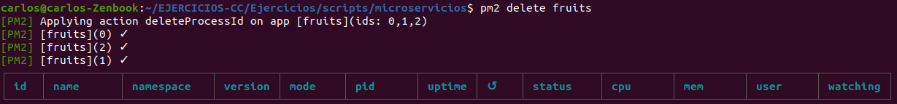

### 6. Ejercicio: Usar rake, invoke o la herramienta equivalente en tu lenguaje de programación para programar diferentes tareas que se puedan lanzar fácilmente desde la línea de órdenes.

Como en el proyecto hemos usado *invoke*, vamos a aprovechar los conocimientos e intentar aplicarlos, para ello se ha diseñado el siguiente fichero ```tasks.py``` que se puede ver [aquí]():

```python
from invoke import task, run

# Tarea de crear y lanzar los procesos
@task 
def start(c):
	run("pm2 start app2.py --name fruits --interpreter python3 -i 3")

# Tarea de parar los procesos
@task 
def stop(c):
	run("pm2 stop fruits")

# Tarea de relanzar los procesos
@task 
def reload(c):
	run("pm2 reload fruits")

# Tarea de describir los procesos
@task 
def describe(c):
	run("pm2 describe fruits")

# Tarea de eliminar los procesos
@task
def delete(c):
	run("pm2 delete fruits")
```

Se puede ver un ejemplo de como se crean los procesos con la orden ```invoke start```, que llama a la tarea *start*:

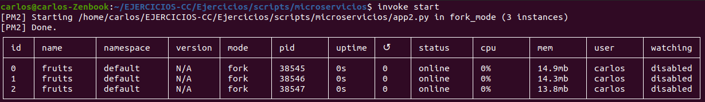
