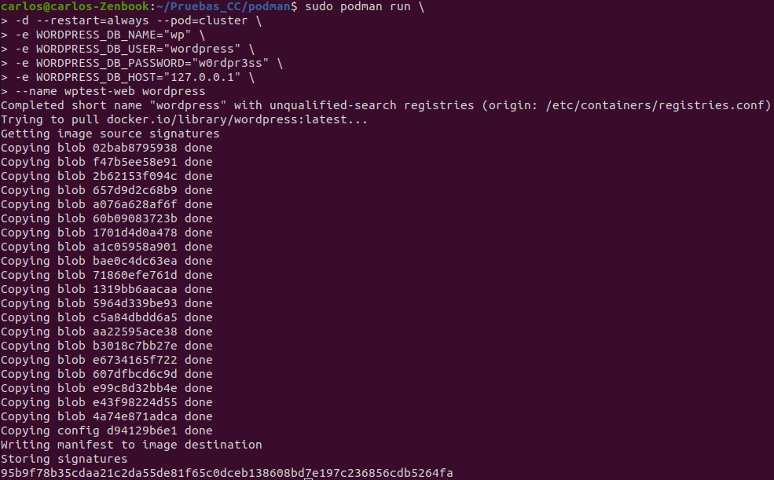
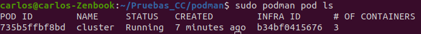

### 1. Crear un pod con dos o más contenedores, de forma que se pueda usar uno desde el otro. Uno de los contenedores contendrá la aplicación que queramos desplegar.

Lo primero de todo es realizar la instalación de podman, con las órdenes:

```shell
sudo apt-get -y update
sudo apt-get install -y podman
```

Una vez instalado, para la composición que se pide, he realizado el procedimiento que se indica en uno de los tutoriales de [redhat](https://www.redhat.com/sysadmin/compose-podman-pods) el cual explica la composición con Podman haciendo uso de dos contenedores que contienen *MariaDB* y *Wordpress*. Para ello lo primero es definir el cluster, en este caso denominado tal cual **cluster**, indicando el puerto 8080 como externo (podman utiliza el puerto 80) con la orden:

```shell
sudo podman pod create --name cluster -p 8080:80
```

A continuación, se crearán los diferentes contenedores dentro del cluster creado, para ello primero crearemos el contenedor que contenga *MariaDB*:

```shell
sudo podman run \
-d --restart=always --pod=cluster \
-e MYSQL_ROOT_PASSWORD="myrootpass" \
-e MYSQL_DATABASE="wp" \
-e MYSQL_USER="wordpress" \
-e MYSQL_PASSWORD="w0rdpr3ss" \
--name=wptest-db mariadb
```


Una vez definida la BD, se crea entonces el contenedor de *Wordpress* que utiliza dicha BD, para ello se utiliza localhost como host de la BD de *Wordpress*:

```shell
sudo podman run \
-d --restart=always --pod=cluster \
-e WORDPRESS_DB_NAME="wp" \
-e WORDPRESS_DB_USER="wordpress" \
-e WORDPRESS_DB_PASSWORD="w0rdpr3ss" \
-e WORDPRESS_DB_HOST="127.0.0.1" \
--name wptest-web wordpress
```



Una vez definidos ambos contendores, se puede observar el contenido del cluster con ```sudo podman ps```:


Se puede ver el cluster con ```sudo podman pod ls```:



Por último, accediendo a localhost, podemos ver que efectivamente funciona el cluster y nos lleva a la pantalla de inicio de configuración de *Wordpress*:


### 2. Usar un miniframework REST para crear un servicio web y introducirlo en un contenedor, y componerlo con un cliente REST que sea el que finalmente se ejecuta y sirve como “frontend”.

Este ejercicio se plantea como una pequeña demostración de microservicios, y su contenerización en contenedores Docker. Para ello vamos a crear dos microservicios, uno como servidor con una API RESTful y otro como un cliente REST que obtiene del servidor el nombre de una asignatura y que se ejecuta como frontend.


Para ello se ha diseñado el siguiente servicio como *servidor* con API RESTful utilizando Python con Flask:

```Python
from flask import Flask, jsonify, request


# initialize our Flask application
app= Flask(__name__)


@app.route("/api_rest_carlos", methods=["GET"])
def message():
    data = "Cloud Computing"
    return jsonify(data)

if __name__=='__main__':
    app.run(host='0.0.0.0')
```

Por otro lado se ha diseñado el siguiente servicio como *cliente* utilizando Python con Request:

```Python
import requests 

r = requests.get("http://172.17.0.1:5000/api_rest_carlos", verify=False).json()

print("La asignatura recibida es %s" % r)
```

A continuación, se han de diseñar los Dockerfiles correspondientes a las imágenes de Docker asociadas a cada servicio, con sus correspondientes ficheros de *requirements* de Python.

**Servidor**

* requirements.txt

```
flask
flask-restful
```

* Dockerfile

```shell
# docker build -t servidor .
# docker run -p 5000:5000 servidor

FROM python:3.8

WORKDIR .

COPY requirements.txt server.py ./

RUN pip install -r requirements.txt

COPY . .

# Abrir puerto 5000
EXPOSE 5000

CMD ["python", "./server.py"]
```

Si lanzamos el servidor y accedemos a nuestro localhost, en el puerto 5000 que es el que trae por defecto configurado Flask, dentro de nuestro directorio */api_rest_carlos*, podemos observar que efectivamente funciona nuestro servidor:


**Cliente**

* requirements.txt

```
requests
```

* Dockerfile

```shell
# docker build -t cliente .
# docker run -p 5001:5001 cliente

FROM python:3.8

WORKDIR .

COPY requirements.txt client.py ./

RUN pip install -r requirements.txt

COPY . .

# Abrir puerto 5001
EXPOSE 5001

CMD ["python", "./client.py"]
```

A continuación, podríamos simplemente construir cada contenedor por separado, ejecutar primero el servidor y a continuación el cliente para que obtuviera la información del servidor. La idea de este ejercicio es ver como dichos microservicios se pueden orquestar mediante la funcionalidad **docker-compose**, el cual tiene su fichero de orquestación *docker-compose.yml*:

```YAML
version: '2'
services:
   servidor:
      container_name: servidor
      restart: always
      build: servidor/.
      ports:
      - "5000:5000"

   cliente:
      container_name: cliente
      build: cliente/.
      stdin_open: true
      depends_on: 
        - servidor
      ports:
      - "5001:5001"
```

A continuación se lanzaría la orquestación con la orden `docker-compose up --build`:


Como podemos observar, empieza a generarse la imagen del servidor, y posteriormente se genera la imagen del cliente. Una vez finalizado se ejecuta la imagen del servidor, y a continuación tal y como hemos indicado en el apartado de dependencia del cliente en el *docker-compose.yml*, se ejecuta el cliente:


