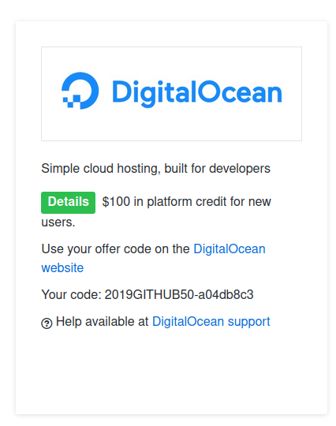
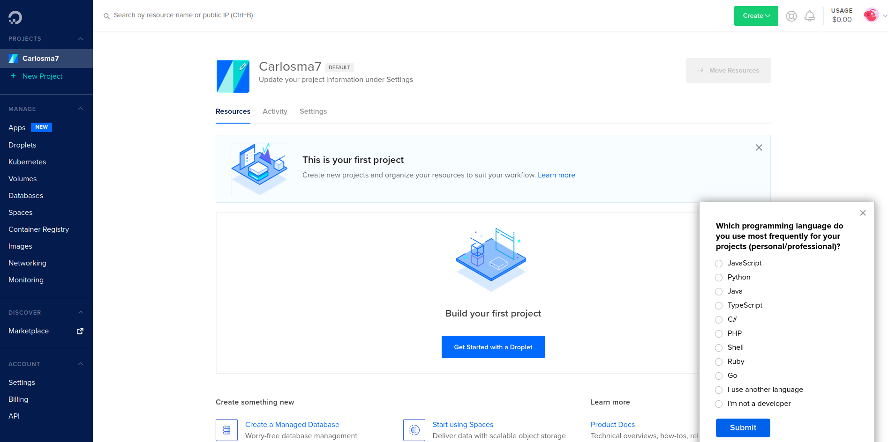
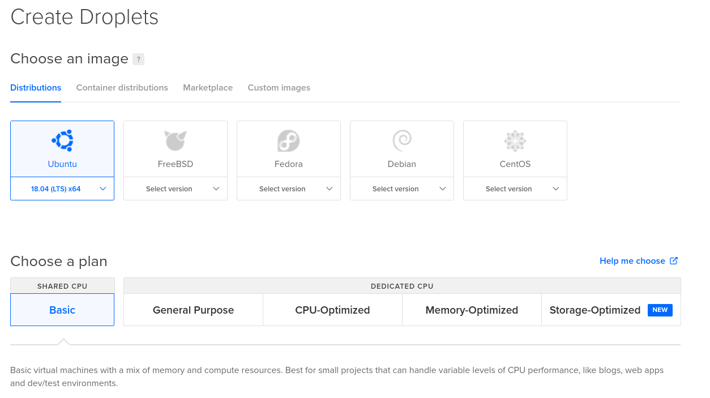
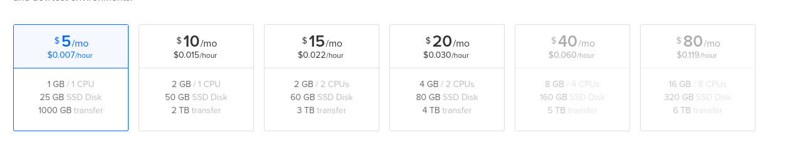
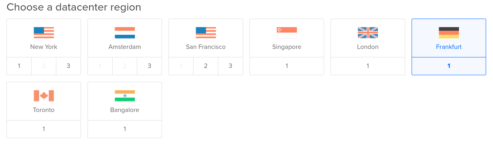
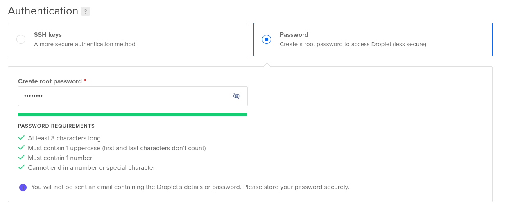
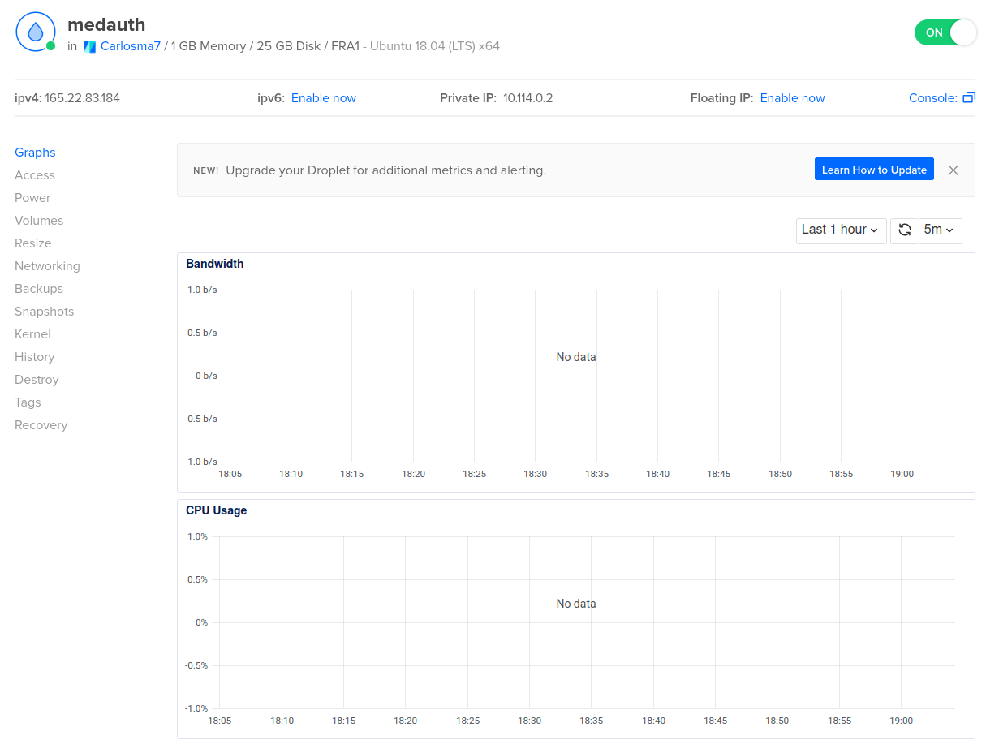

## Obtener un droplet en Digital Ocean

---

Dentro de los servicios de *IaaS* existen diferentes opciones, pero aprovechando las condiciones de la oferta de *GitHub Education*, que ofrece créditos para **Digital Ocean**, se ha decidido aprovechar esta ventaja y desplegar el proyecto utilizando un *droplet* de la misma.



Una vez aceptada la oferta, nos dirigimos a la página oficial de *Digital Ocean* donde nos registramos con la cuenta de *GitHub* y tras aceptar los términos y canjear el código de promoción nos dirigiremos al proyecto inicial.



Una vez aquí seleccionaremos el botón ```Get Started with a Droplet``` para definir nuestra primera máquina virtual. Una vez empezamos a definir nuestra instancia seguimos los siguientes pasos:

1. Escoger una imagen y plan para nuestra instancia. En este caso basta con un plan básico, y tras informarnos un poco se decide escoger una imagen de *Ubuntu 18.04* ya que la distro *20.04* ha reportado determinados problemas con *docker-compose*.

	

2. Escoger plan de pago, en este caso bastará con el más básico.

	

3. Escoger una region, preferiblemente cercana a nuestra ubicación real, para tener una menor latencia, por lo que se ha escogido *Frankfurt (Alemania)*.

	

4. Escoger un sistema de autenticación, en este caso con una contraseña será suficiente para realizar las conexiones.

	

5. Por último, crearemos la instancia y esperamos a que esta se construya.

Una vez construida la instancia, podemos observar esta dentro de nuestro proyecto:


