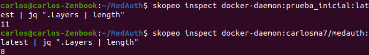

## Construcción Dockerfile

---

Para la realización de este tutorial se ha utilizado el [tutorial oficial de Docker](https://docs.docker.com/engine/reference/builder/).

### ¿Qué es un contenedor Docker?

Un contenedor es una unidad estándar de software que empaqueta el código y todas sus dependencias, por lo que las aplicaciones pueden ejecutarse de forma rápida y confiable de un entorno informático a otro. La imagen del contenedor Docker es un paquete de software ligero, autónomo y ejecutable que incluye todo lo necesario para ejecutar la aplicación: código, tiempo de ejecución, herramientas del sistema, bibliotecas del sistema y configuraciones.

### ¿Cómo se construye una imagen de Docker?

*Docker* puede crear automáticamente una imagen leyendo las instrucciones en el fichero *Dockerfile*. Un *Dockerfile* es un documento de texto que contiene todos los comandos que el usuario puede llamar en la línea de comandos para ensamblar la imagen. Al utilizar una compilación de *Docker*, los usuarios pueden crear una compilación automatizada que ejecute varias instrucciones de línea de comandos de forma continua.

Un ejemplo de *Dockerfile* es el siguiente utilizado en el proyecto de la asignatura:


```dockerfile
# Python 3.8-slim (Debian buster-slim based)
FROM python:3.8-slim

# Se indica mantenedor de la imagen
MAINTAINER Carlos Morales <carlos7ma@correo.ugr.es>

# Creación de usuario con permisos básicos
RUN useradd -ms /bin/bash medauth \
	&& mkdir -p app/test \
	&& chown medauth /app/test

# Se configura para utilizarse el usuario creado
USER medauth

# Se configura el directorio de trabajo
WORKDIR /app/test

# Se copia el fichero de requisitos de paquetes pip
COPY requirements.txt .

# Instalación de los requisitos y se borra el fichero tras la instalación
RUN pip install -r requirements.txt --no-warn-script-location \
	&& rm requirements.txt


# Se configura el PATH para ejecutar paquetes de Pip
ENV PATH=/home/medauth/.local/bin:$PATH

# Ejecución
CMD ["invoke", "tests"]
```

Existen numerosas órdenes en un *Dockerfile*, entre las que se destacan:

* **FROM**: La instrucción FROM inicializa una nueva etapa de compilación y establece la imagen base para instrucciones posteriores.

* **MAINTAINER**: Indica el encargado del mantenimiento del contenedor.

* **RUN**: La instrucción RUN ejecutará cualquier comando en la nueva capa sobre la imagen actual y confirmará el resultado. La imagen resultante se utilizará en el siguiente paso del Dockerfile. Ejecutar sentencias RUN jerárquicamente y generar confirmaciones se ajusta a la base de Docker. En Docker, las ejecuciones son económicas y los contenedores se pueden crear en cualquier lugar del historial de la imagen, al igual que el control de código fuente. Uno de los puntos importantes es la reducción de capas mediante agrupación de ejecuciones.

* **USER**: Indica el usuario activo en la construcción de la imagen.

* **WORKDIR**: Establece el directorio de trabajo sobre el que trabaja la construcción de la imagen.

* **COPY** y **ADD**: Aunque en un principio ambas sirven para copiar información local en el contenedor, se recomienda siempre que utilizar *COPY* como primera opción. *ADD* además incorpora ventajas como la utilización de descompresión de ficheros *tar* o asignación de *url*.

* **ENV**: Como su nombre indica, sirve para establecer variables de entorno en nuestra imagen.

* **CMD**: Este comando se encarga de pasar valores por defecto a un contenedor. Entre estos valores se pueden pasar ejecutables. Solo existe uno por Dockerfile, en caso de existir varios solo se tiene en cuenta el último.

Existen otras instrucciones más como **ENTRYPOINT**, **LABEL**, etc. Realmente hay que tener una serie de condiciones y [buenas prácticas](https://docs.docker.com/develop/develop-images/dockerfile_best-practices/) a la hora de construir la imagen del contenedor Docker.

### Optimización de imagen

Uno de los principales problemas a la hora de diseñar una imagen para el contenedor, es la optimización de su construcción, ya que muchas operaciones se realizan de forma que se generan demasiadas capas y esto puede resultar en una imagen más grande. Para ello existen herramientas como [skopeo](https://github.com/containers/skopeo) que permiten observar el número de capas, y optimizar la imagen:



Como se puede observar, se ha reducido el número de capas en 3. Esto se puede conseguir mediante agrupación de órdenes como por ejemplo *RUN*. Además, otro detalle importante en la optimización de la imagen

El *Dockerfile* del proyecto de ejemplo del proyecto de la asignatura se puede ver [aquí](https://github.com/Carlosma7/MedAuth/blob/main/Dockerfile).
